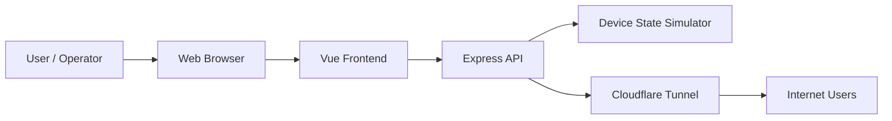

# Threat Model for the Embedded Web Device Demo

## 1. Purpose and scope

This threat model covers the current demo application, including the Vue 3 frontend, the Express backend, the simulated device state, and the public Cloudflare tunnel deployment path described in the project documentation.

The goal is to identify the most important security risks, explain how they affect the application, and suggest practical mitigations that fit a small embedded-style web service.

## 2. System overview

### Main components
- Frontend: Vue 3 + Vite UI in [frontend/src/App.vue](frontend/src/App.vue)
- Backend: Express API and device simulator in [server/server.js](server/server.js)
- Deployment path: local development server, optional public tunnel exposure, and browser access

## 3. Assets to protect

- Authentication credentials for demo users
- Session tokens and user roles
- Device telemetry and configuration values
- User-management endpoints and service/admin privileges
- Availability of the service and tunnel URL

## 4. Trust boundaries

1. Browser to frontend
   - User input enters the UI and is sent to the API.

2. Frontend to backend API
   - The frontend sends bearer tokens and device configuration updates.

3. Backend to in-memory device state
   - The server maintains simulated telemetry and configuration state.

4. Backend to public internet via Cloudflare tunnel
   - The tunnel exposes the application beyond localhost.

## 5. Threats using STRIDE

### Spoofing

Threats:
- Hard-coded demo credentials can be guessed or reused.
- A stolen bearer token can be replayed by an attacker.
- The login endpoint does not protect against brute force or credential stuffing.

Impact:
- An attacker could impersonate a user, admin, or service role.

Mitigations:
- Replace hard-coded credentials with a proper identity store.
- Use hashed passwords and salt.
- Rotate tokens and expire sessions.
- Add rate limiting on login endpoints.

### Tampering

Threats:
- The configuration update endpoint accepts numeric values without signing or versioning.
- There is no integrity control for device config changes.
- A malicious client can send altered values if it has a valid token.

Impact:
- Device configuration can be changed unexpectedly.
- Safety-related settings could be pushed to unsafe values.

Mitigations:
- Enforce role-based approval for sensitive changes.
- Require audit logging and change reviews.
- Add server-side validation and safe limits.
- Consider signed or versioned configuration updates for production use.

### Repudiation

Threats:
- Login attempts and config changes are only logged to the console.
- There is no durable audit trail for who changed what and when.

Impact:
- It becomes difficult to investigate suspicious activity.

Mitigations:
- Add structured logs with timestamps, actor, action, and result.
- Store audit events in a protected log store.
- Record configuration changes and user creation events.

### Information disclosure

Threats:
- The backend logs authentication tokens to the terminal during login.
- The API exposes user role and configuration data over authenticated routes.
- Public tunnel exposure can leak the service to unintended users if no access control is added.

Impact:
- Attackers may recover secrets or learn internal device settings.

Mitigations:
- Never log tokens or passwords.
- Limit response payloads to the minimum required data.
- Enforce HTTPS and remove public exposure unless necessary.
- Add access controls around the tunnel and reverse proxy.

### Denial of Service

Threats:
- The frontend polls telemetry every 2 seconds.
- The backend has no explicit rate limiting or request size limits.
- The public tunnel increases the attack surface.

Impact:
- Resource exhaustion can degrade the service or make it unavailable.

Mitigations:
- Add rate limiting and request size caps.
- Throttle polling and avoid unnecessary refreshes.
- Deploy behind a reverse proxy with WAF and request limits.
- Monitor CPU, memory, and connection counts.

### Elevation of privilege

Threats:
- The service role can create new user accounts, including admin and user roles.
- Any attacker who obtains a service token could create new privileged accounts.
- The current demo relies on a simple role check and in-memory state.

Impact:
- A compromised service account could fully change the user model.

Mitigations:
- Use a least-privilege model and separate creation rights from operational rights.
- Require MFA or stronger identity proofing for privileged roles.
- Restrict service account use to limited automation workflows.
- Prefer a real identity provider in production.

## 6. Risks specific to the current implementation

The following issues are visible in the current code:

- Plaintext demo credentials are embedded in the backend in [server/server.js](server/server.js).
- Session tokens are stored in memory and not rotated or expired in [server/server.js](server/server.js).
- Authentication and authorization are implemented as simple middleware, but there is still no strong secret-management or audit strategy.
- The frontend sends bearer tokens directly from the browser in [frontend/src/App.vue](frontend/src/App.vue).
- The application is exposed through a public tunnel in the deployment instructions, which increases external exposure.

## 7. Recommended priority actions

### Highest priority
1. Remove hard-coded credentials and replace them with a secure user store.
2. Stop logging tokens and secrets.
3. Add HTTPS-only access and protect the public tunnel with authentication or restrict it.
4. Add rate limiting and request validation.

### Medium priority
5. Introduce proper session expiration and rotation.
6. Add audit logging for login, user creation, and config updates.
7. Implement stronger role separation and approval workflows for sensitive operations.

### Longer-term
8. Move to a real identity provider and secret manager.
9. Add monitoring, alerting, and incident response playbooks.
10. Consider introducing device signing or trusted update workflows if this evolves into a real industrial deployment.

## 8. Threat register summary

| Threat | Likelihood | Impact | Recommended control |
| --- | --- | --- | --- |
| Credential guessing or reuse | High | High | Strong password policy, rate limiting, account lockout |
| Token theft or replay | Medium | High | Short-lived tokens, rotation, HTTPS |
| Unauthorized config changes | Medium | High | Role-based approval and audit logging |
| Sensitive data leakage | Medium | Medium | Minimize payloads, avoid token logging, restrict public exposure |
| Denial of service | Medium | Medium | Rate limits, request caps, monitoring |
| Privilege abuse | Medium | High | Least privilege and separate admin workflows |

## 9. Conclusion

The current demo is useful for learning, but it has several important security weaknesses if exposed beyond a local test environment. The most important next steps are to harden authentication, reduce public exposure, add logging and rate limiting, and treat configuration changes as sensitive operations.
